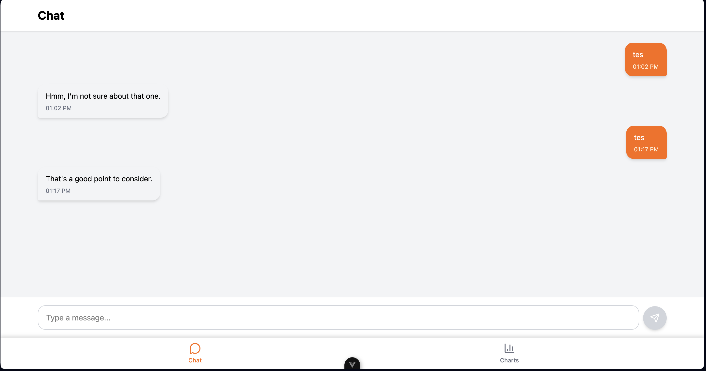
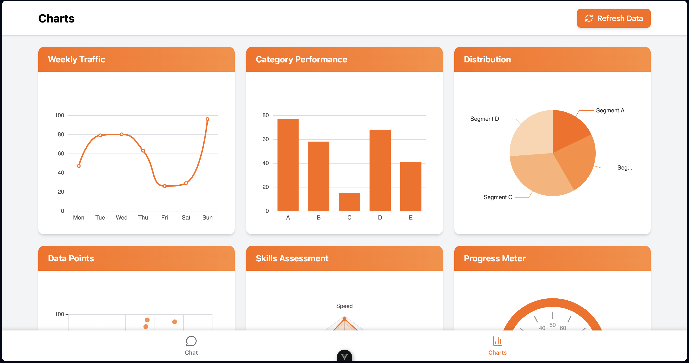

# 🎨 Vue3 Chat & Chart PWA

A Progressive Web App built with Vue 3 for exploring chat interfaces and data visualization with mobile-first design.




## ✨ Features

- 📱 **Progressive Web App** - Installable, works offline
- 💬 **Chat Interface** - Demo chat with random bot responses
- 📊 **6 Chart Types** - Line, Bar, Pie, Scatter, Radar, Gauge (Apache ECharts)
- 🎨 **Mobile-First** - Bottom navigation, responsive design
- 🟠 **Orange Theme** - Modern color scheme (#FF6B00)

## 🛠️ Tech Stack

- Vue 3 + TypeScript + Vite
- Pinia (State) + Vue Router (Navigation)
- Tailwind CSS 4 + Reka UI
- Apache ECharts + vue-echarts
- vite-plugin-pwa (Service Worker)

## 📦 Installation

```bash
# Clone repo
git clone https://github.com/taufikmuharrom/vue3-chat-chart-pwa.git
cd vue3-chat-chart-pwa

# Install (requires pnpm)
pnpm install

# Development
pnpm dev

# Build
pnpm build

# Preview
pnpm preview
```

## 📱 PWA Setup

### Install as App

1. Visit website on mobile/desktop
2. Browser prompts "Install app"
3. Click install → Icon on home screen
4. Opens in standalone mode (no browser UI)

### Offline Support

- Service Worker caches all assets
- Works without internet after first visit
- Chat history saved in localStorage

## 📁 Project Structure

```
src/
├── components/          # UI components
│   ├── BottomNav.vue    # Bottom navigation
│   ├── ChatInput.vue    # Chat input field
│   ├── ChatMessage.vue  # Chat bubble
│   └── ChartCard.vue    # Chart wrapper
├── views/               # Pages
│   ├── ChatView.vue     # Chat page
│   └── ChartsView.vue   # Charts page (6 types)
├── stores/              # Pinia stores
│   ├── chatStore.ts     # Chat state
│   └── chartStore.ts    # Chart data
├── router/              # Routes
└── utils/               # Helpers (random data)
```

## 🎯 Chart Types

1. **Line Chart** - Weekly trends
2. **Bar Chart** - Category comparison
3. **Pie Chart** - Distribution
4. **Scatter Chart** - Data correlations
5. **Radar Chart** - Multi-metric assessment
6. **Gauge Chart** - Progress meter

All charts use random data and can be refreshed.

## 🎨 Design

- **Colors**: Orange (#FF6B00), Black, White
- **Layout**: 1 column (mobile) → 2 columns (tablet) → 3 columns (desktop)
- **Navigation**: Fixed bottom bar with Chat & Charts tabs

## 🚀 Deployment

```bash
# Build for production
pnpm build

# Deploy dist/ folder to:
# - Vercel, Netlify, GitHub Pages
# - Any static hosting
```

## 👤 Author

[taufikmuharrom](https://github.com/taufikmuharrom)
